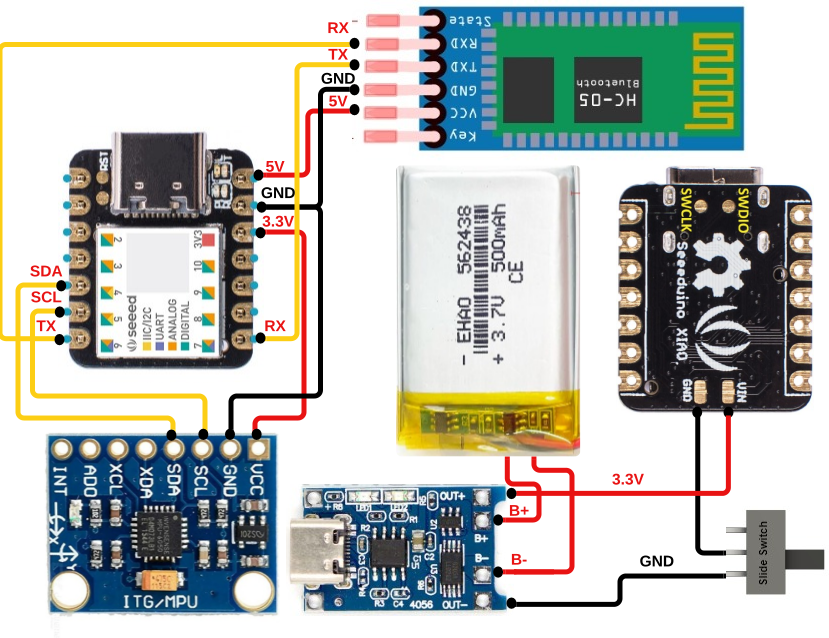
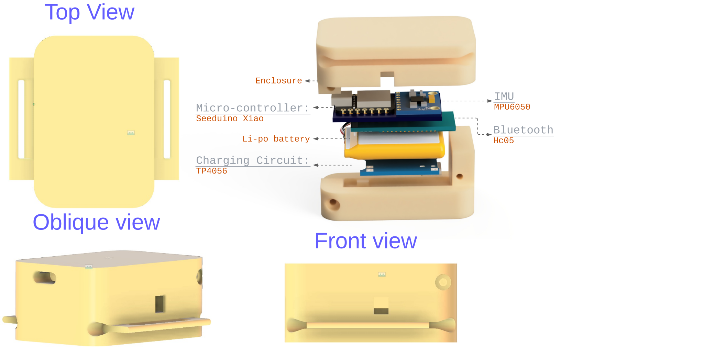

# **Romiumeter: An open source device for measuring range of motion using an inertial measurement unit.**

<!-- 
 -->

This project aims at providing an opensource platform for measuring range of motion an inertial measurement unit.

This document provide information on the components needed to build the Romiumeter, how to program, assemble and use them.
# **Set Up**
Required/useful skills to have:
* 3D printing experience
* CAD modeling (only if planning on modifying or redesigning the case)
* Soldering
* Programming experience in C,C++, Arduino, and/or Python (only if planning on modifying firmware or software components of the project)
## **Required Components**
The Romiumeter was designed using the list of components below. 

 * [Seeed Studio XIAO SAMD21](https://store.arduino.cc/products/arduino-nano-33-ble-sensehttps://robu.in/product/seeeduino-xiao-arduino-microcontroller-samd21-cortex-m0/?gad_source=1&gclid=Cj0KCQjw3tCyBhDBARIsAEY0XNkXfUqEijscYLV9dqZ0D39PEh5-1lQYsB4pxj0swb15M7rGiBKHlAQaAmqxEALw_wcB)
 * [MPU6050 IMU](https://robu.in/product/mpu-6050-gyro-sensor-2-accelerometer/?gad_source=1&gclid=Cj0KCQjw3tCyBhDBARIsAEY0XNmUI0uSGGGOZwqeZBXaYQej43m4iGKMcZQmrrCO0jKbx9LgxYAyDqoaAsTsEALw_wcB)
 * [Slide switch](https://www.ubuy.co.in/product/HBL8VWM-cylewet-10pcs-12mm-vertical-slide-switch-spdt-1p2t-with-3-pins-pcb-panel-for-arduino-pack-of-10-cyt1)
 * [HC05 Bluetooth Module](https://www.digikey.com.au/en/products/detail/te-connectivity-alcoswitch-switches/1825910-6/1632536](https://robu.in/product/hc-05-4pin-bluetooth-modulemasterslave-with-button/))
 * [LiPo Battery 500mAh 3.7V](https://robu.in/product/500mah-pcm-protected-micro-li-po-battery/)
 * [TP4056 1A Li-ion lithium Battery Charging Module](https://robu.in/product/tp4056-1a-li-ion-lithium-battery-charging-module-with-current-protection-type-c/)
 * 1000 mm of 30 AWG hook up wire
   
In addition to this component access to the following is required:
* 3D printing equipment and filament (we used PLA+)
* Soldering Iron
## **Firmware**
#### **Setting up the Arduino environment**
---
Before flashing the arduino program to the seeeduino, the Arduino IDE must be set as follows:
- Install Arduino IDE 1.8.12 or above from: https://www.arduino.cc/en/software#future-version-of-the-arduino-ide
- Add Seeeduino URL to preferences by following the guide here: https://wiki.seeedstudio.com/Seeeduino-XIAO/
- Install Board Support for Seeed SAMD Boards using Board Manager by following the guide here:https://wiki.seeedstudio.com/Seeeduino-XIAO/
- Select Seeeduino XIAO
- Install libraries using Library Manager
    - Required: 
      - Encoder by Paul Stoffregen
   

(<a href="#readme-top">back to top</a>)

#### **Uploading Firmware Onto The SEEEDUINO XIAO**
---
Once the Arduino IDE has been set up, open the [Romiumeter.ino](/Firmware/Romiumeter.ino) file.

Connect the Seeduino XIAO to your computer, select the correct com port and press the upload button. The project may take a while to compile

(<a href="#readme-top">back to top</a>)

## **Hardware**

### **Soldering The Components**
---
Use the wiring diagram below to solder the components together.  
The wires need to be long enough to reach the components but short enough to fit in the case. 

 
[Figure 1.](Documentation/Romiumeter_schematic.svg) Romiumeter wiring Diagram 

At this stage if you have soldered a Romiumeter it is a good idea to test them before putting the components in the case. To do so follow the steps outlined in the [Using the Romiumeter](#Using_the_Romiumeter) section.

(<a href="#readme-top">back to top</a>)

### **Assembling The Case**
---
Before assembling the case, 3D print the models in. It is recommended to use a semi-see-through material when 3D printing the case so that the led's are visible from the outside.
Once printed and all the components soldered place them in to the case as follows:  
1. Place the PCB with soldered Seeeduino XIAO,IMU, and HC05 Bluetooth module inside the bottom half of the case (see [Figure 5](Documentation/hardware_romiumeter.svg)) with the Seeeduino XIAO and IMU touching the bottom of the case.
2. Place the Slide Switch in their respective frames.
3. Place the TP4056 charging module inside the top half of the case with the type C port fitting into the hole partly.
4. Place the battery between the TP4056 module and the Bluetooth module.
6. Join the two halves of the case.  
   Make sure the wires are not stuck in between the top and the bottom half of the case.

<!--
clearly illustrate how components are to be fitted together, include some screenshots of the title animation and recommended order of steps for assembly
-->

 
[Figure 5.](Documentation/hardware_romiumeter.svg) Romiumeter 3d model 

(<a href="#readme-top">back to top</a>)

## **Software**

 For convenience, a python program was written to record and save the data in respective folders. The source code is available in the [Software](/Software/) folder. This code can be run from python.

